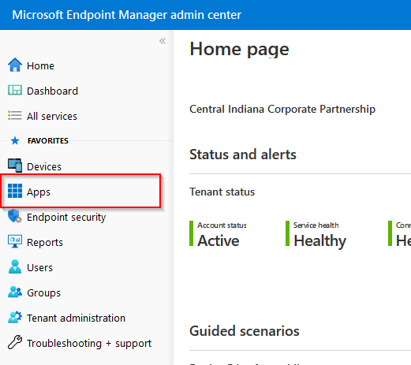
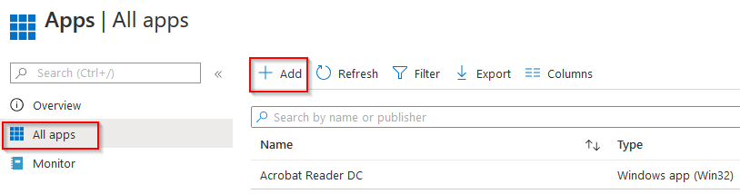
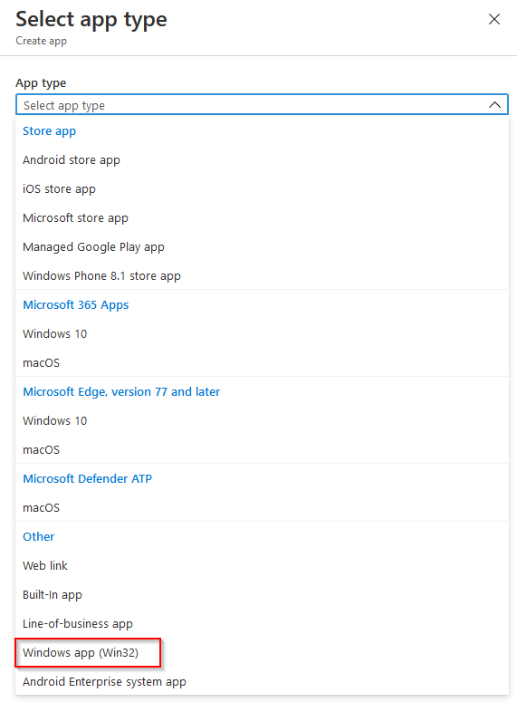
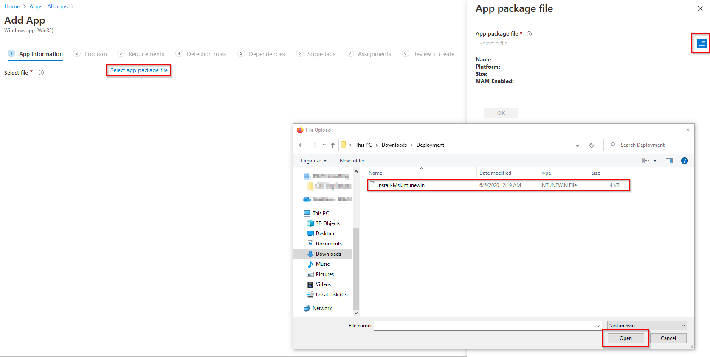
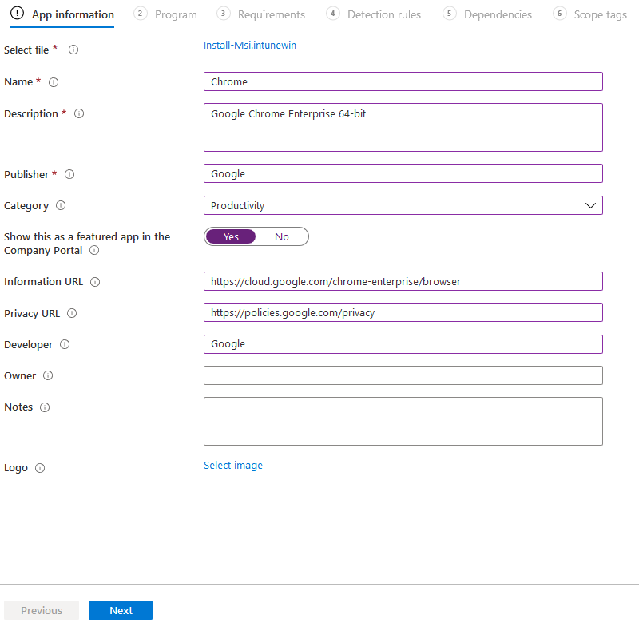

# Create Intune App Deployment
## Windows MSI

### Prerequisites:
- Access to Windows MSI installer via URL or a local copy

### Determine distribution method:
1. Download from web (downloadUrl)
    - This requires a publicly accessible web URL that the MSI package is available at.
    - This allows for the MSI to be updated without needing to rebuild the deployment package.
    - You aren't able to take advantage of some of the features such as Delivery Optimization: https://oliverkieselbach.com/2020/03/07/delivery-optimization-with-intune-and-microsoft-connected-cache-mcc/
2. Bundled in deployment package (packagedInstaller)
    - This requires the deployment package be build with the MSI in the same directory as the script.
    - Package will need to be recreated on updates. More frequent updates required.
    - You are able to leverage Delivery Optimization.

## Build the deployment package
1. Download the script if you don't already from https://raw.githubusercontent.com/zchoate/Intune-Applications/main/Install-Msi.ps1. 
```
Invoke-RestMethod -Uri "https://raw.githubusercontent.com/zchoate/Intune-Applications/main/Install-Msi.ps1" -OutFile "$env:UserProfile\Downloads\Deployment\Install-Msi.ps1"
```
2. Download the Intune package tool and unzip: https://github.com/microsoft/Microsoft-Win32-Content-Prep-Tool/archive/v1.8.1.zip. This can be saved to any accessible directory.
3. If you're going with the PackagedInstaller option, download your installer and place in the same directory as the Install-Msi.ps1 script. This should only contain these 2 files.
4. Run the Intune package tool in the terminal. You'll need to specify the following information:
    - `-c <setup_folder>`
    - `-s <source_setup_file>`
    - `-o <output_folder>`
    - `-q` to overwrite any existing output files
```
.\IntuneWinAppUtil.exe -c Deployment -s Install-Msi.ps1 -o Deployment -q
```
5. You should now have an Install-Msi.intunewin file in your Deployment folder.

## Create the application deployment in Intune
1. Pull up the Microsoft Endpoint Manager admin center: https://devicemanagement.microsoft.com.
2. Select Apps on the left.  

4. Select All Apps and then Add.

5. Select Windows app (Win32) as the App type. 

6. Click `Select the app package file` and navigate the deployment package created in the previous section. 

7. Choose an appropriate name, description, publisher, category, etc. and move to the next step. 

8. Input your install and uninstall commands in the following pattern:
```
# For the DownloadUrl option:
Powershell.exe -ExecutionPolicy Bypass -File Install-Msi.ps1 -downloadUrl "https://website.com/path/to.msi"
# For the PackagedInstaller option:
Powershell.exe -ExecutionPolicy Bypass -File Install-Msi.ps1 -packagedInstaller "nameof.msi"
# To uninstall:
Powershell.exe -ExecutionPolicy Bypass -File Install-Msi.ps1 -uninstall "name of application"
```
8. Choose the appropriate requirements for your application.
9. Choose the appropriate detection rules for the application. File is the quickest and most consistent mechanism in my experience. You can select multiple rules or even create a custom detection script.
10. Choose any dependencies if required (these should already exist as separate deployment packages but dependencies don't need to be assigned to any groups).
11. Assign the application:
    - Required: This will push to the assigned devices/users and will reinstall the application if it no longer meets the detection rules.
    - Available for enrolled device: This makes it available in the Company Portal.
    - Uninstall: Removes the application from the assigned devices/users.
12. Create the deployment.
