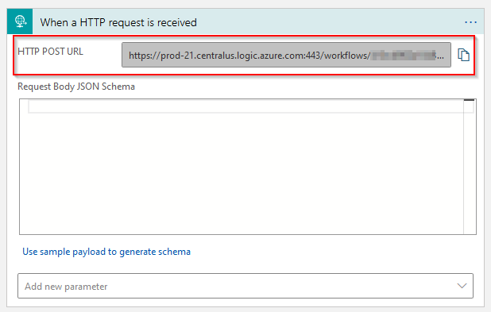
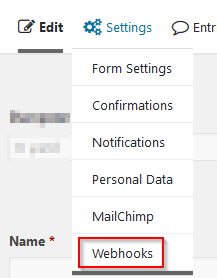
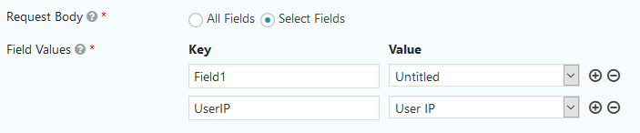
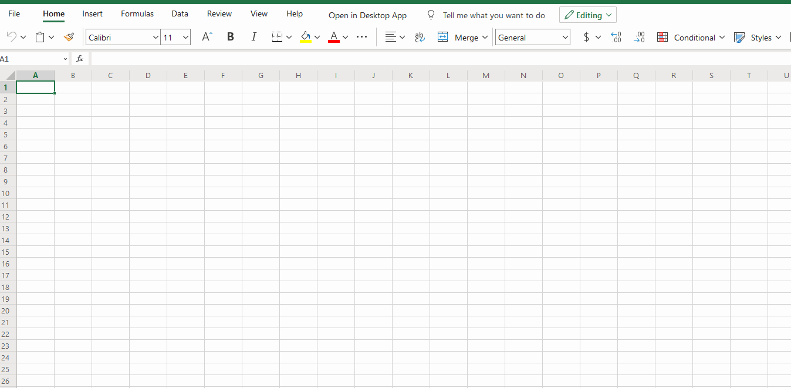
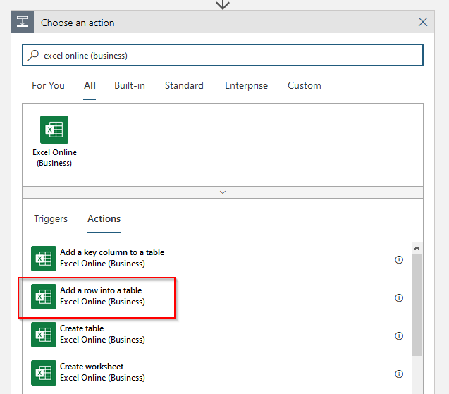
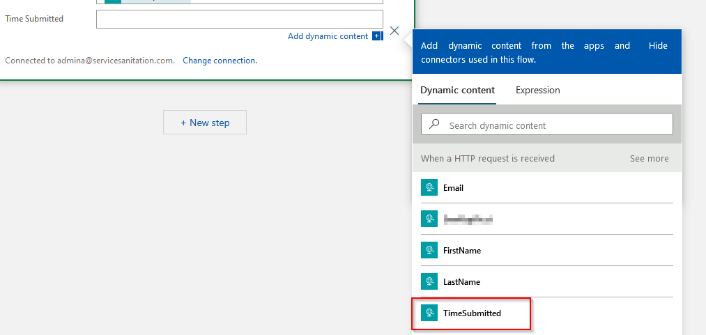

# Send GravityForms Submissions to Excel Online

### Prerequisites:
- GravityForms Elite subscription
- Azure subscription
- Form is already created
- GravityForms Webhook Addin is already installed
- Excel spreadsheet with table created in Sharepoint/Teams/OneDrive

## Creating a Logic App
1. Within the Azure portal, search for Logic App and select the Marketplace option - Logic App. 
2. Select the appropriate subscription, resource group (or create a new resource group), create a Logic App name, select the location (region is the default and applies to most situations) and the related datacenter. 
3. Assign tags as needed such as company:nameofcompanytobillback.
4. Review and create the resource.
5. Within the resource, you should be prompted to start with a common trigger, select "When a HTTP request is received". 
6. Save the Logic App design - this should generate your HTTP Post URL to be used later on. 

## Creating a Webhook Feed 
1. Within the form editor, navigate to Settings > Webhooks </br> 
2. Add a new webhook feed.
3. Select a name for the feed - I would recommend the name of the form.
4. Take the HTTP Post URL from the Logic App setup and paste into the Request URL field. You may need to modify the sp value as shown to remove %2F and replace with / as %2F will cause an error on creation.
`https://prod.../workflows/.../triggers/manual/paths/invoke?api-version=2016-10-01&sp=%2Ftriggers%2Fmanual%2Frun&sv=1.0...` to `https://prod.../workflows/.../triggers/manual/paths/invoke?api-version=2016-10-01&sp=/triggers/manual/run&sv=1.0...`
5. Select your fields that you'd like to include as part of your POST request. You can choose to include All Fields or Select Fields. All Fields will include all visible form fields as well as Entry ID, Source IP, etc. Take note of your Key:Value mappings. </br> 
6. Update Settings.

## Create an Excel Spreadsheet
1. From Teams, Sharepoint, or Onedrive create an Excel spreadsheet that will be the destination of the forms results.
2. Create a table in Excel by navigating to Insert, Table. Give your table headers by selecting the box when initially creating. </br> 
3. Add additional columns by selecting the table and pulling to the right. </br> 
4. Rename the spreadsheet and any columns as desired. These can be any names that make sense and don't have to match up with the Keys created in the webhook.

## Logic App JSON Schema
We need to build out the Request Body JSON schema to grab the appropriate data. This can be done by using a sample payload (submit a form with just the webhook and look at the Logic App run details to get the payload) or by building out the schema manually. I'll show you how to build out the schema.

All of the requests will look largely like this:
```
{
    "properties": {
        "KeyName1": {
            "type": "string"
        },
        "KeyName2": {
            "type": "string"
        }
    },
    "type": "object"
}
```
"KeyName1" would map to KeyName1 and "KeyName2" would map to KeyName2. You can use the keys created with the webhook feed to build this list. If the data isn't a string, then you'll need to adjust the type appropriately.

## Logic App Excel Action
1. Add a new step to the Logic App. </br> 
2. Search for "excel online (business)" and select the `Add a row into a table` action. </br> 
3. Select the location of your spreadsheet, OneDrive for Business, Teams, or the Sharepoint site.
4. Select the appropriate document library.
5. Navigate to the file using the folder button on the right side of the File field.
6. Select the table name. If it doesn't populate, by default it will be named Table1.
7. Click `Add a new parameter` and choose the columns you want to add data to when a new row is created.
8. You should now see new fields for each of the respective columns. Click in each field and expand `When a HTTP request is received`. Select the appropriate value from this list. </br> 
9. Save your Logic App and wait for the form submissions to add new rows to your spreadsheet.

### Note:
Runs history will be incredibly helpful in debugging issues and seeing what data is getting passed from point A to B. You can review the raw input and output and see any associated errors.
